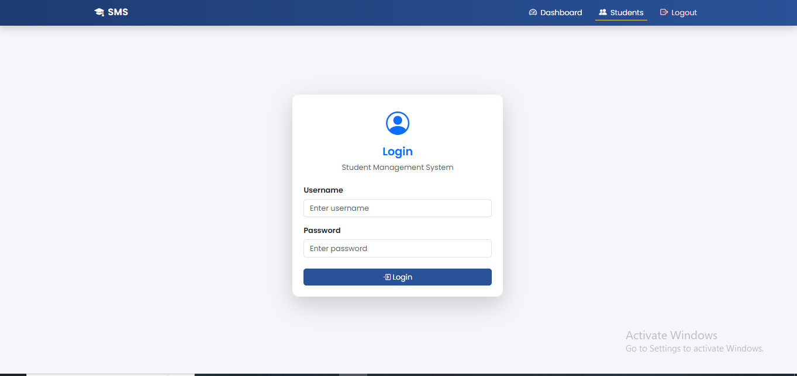
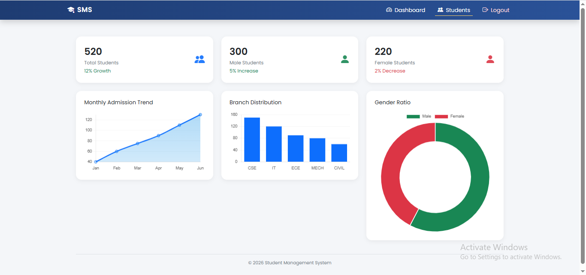
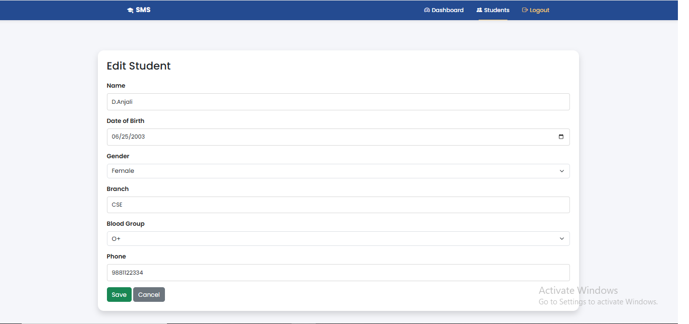
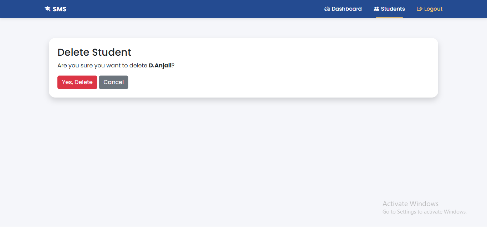
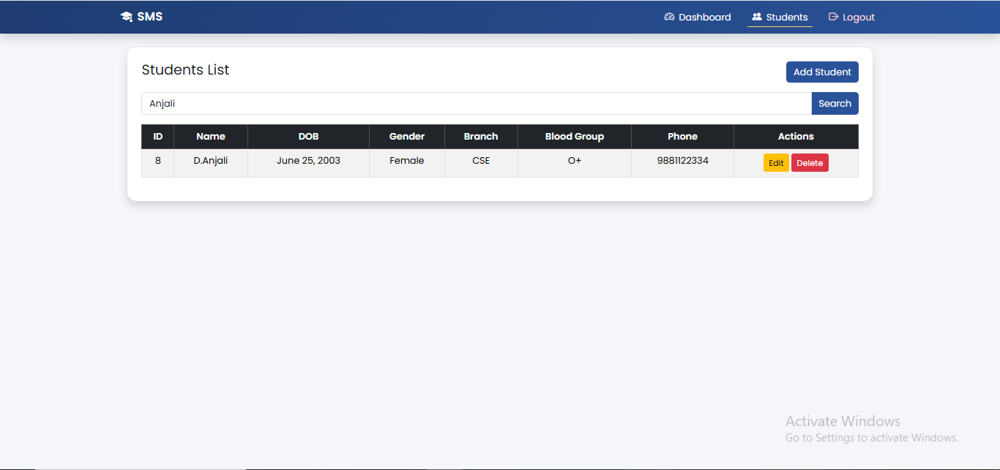
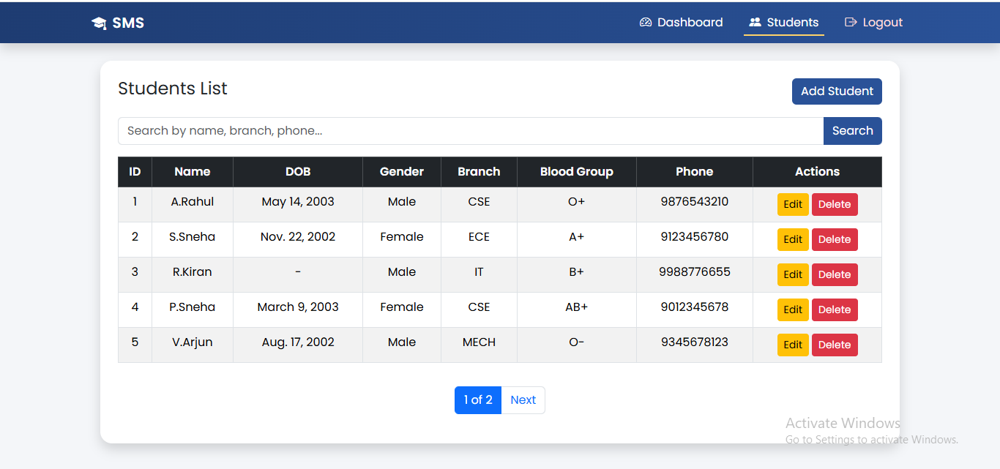
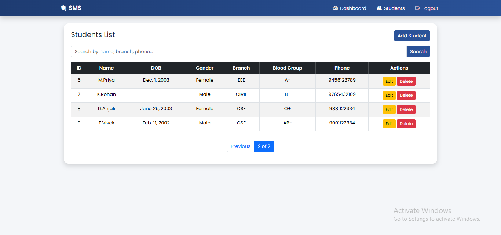

# 🎓 Student Management System

A **Django-based Student Management System** that allows administrators to manage student records efficiently.  
The system includes authentication, a dashboard, and full **CRUD operations** with search and pagination features.

---

## 📌 Project Overview

This project is designed to simplify the process of managing student data in an educational institution.  
It provides an intuitive interface for administrators to **add, edit, delete, search, and view student records**.

The application is built using **Django framework**, ensuring scalability, security, and maintainability.

---

## 🚀 Features

✔️ Secure Login System  
✔️ Admin Dashboard  
✔️ Add New Student  
✔️ Edit Student Information  
✔️ Delete Student Records  
✔️ Search Students  
✔️ Pagination for Student List  
✔️ Responsive User Interface  

---

## 🛠️ Technologies Used

| Technology | Purpose |
|-----------|--------|
| 🐍 Python | Backend programming |
| 🌐 Django | Web framework |
| 🎨 HTML | Structure of web pages |
| 💅 CSS | Styling |
| 🎯 Bootstrap | Responsive design |
| 🗄️ SQLite | Database |

---

## 📂 Project Structure

```
Student_Management_System_Project
│
├── Django_Project_Code
│   └── ABHIGNA_12_FEB
│       ├── students_app
│       ├── students_project
│       ├── manage.py
│       └── db.sqlite3
│
├── Project_Image
│   ├── Add_Student_Form.png
│   ├── Dashboard.png
│   ├── Delete_Student.png
│   ├── Edit_Student_Form.png
│   ├── Login_Page.png
│   ├── Search.png
│   ├── Students_Page1.png
│   └── Students_Page2.png
│
├── Project_Report
├── .gitignore
└── README.md
```

---

## 📸 Screenshots

### 🔐 Login Page


### 📊 Dashboard


### ➕ Add Student


### ✏️ Edit Student


### ❌ Delete Student


### 🔍 Search Students


### 📋 Students List


### 📋 Students List (Page 2)


---

## ⚙️ Installation & Setup

Follow these steps to run the project locally.

### 1️⃣ Clone the Repository

```
git clone https://github.com/Abhigna13/ABHIGNA_12_FEB.git
```

### 2️⃣ Navigate to the Project Folder

```
cd Django_Project_Code/ABHIGNA_12_FEB
```

### 3️⃣ Install Dependencies

```
pip install django
```

### 4️⃣ Run Migrations

```
python manage.py migrate
```

### 5️⃣ Start the Development Server

```
python manage.py runserver
```

### 6️⃣ Open in Browser

```
http://127.0.0.1:8000/
```

---

## 👩‍💻 Author

**Abhigna**

Django Developer  
Student Management System Project

---

## ⭐ Support

If you found this project helpful, consider giving it a **⭐ on GitHub**.
